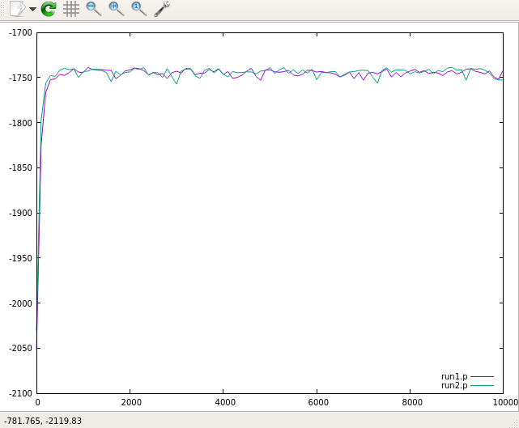
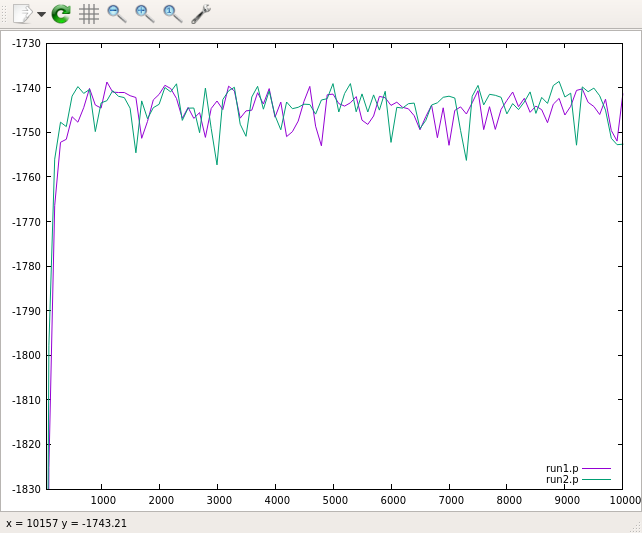
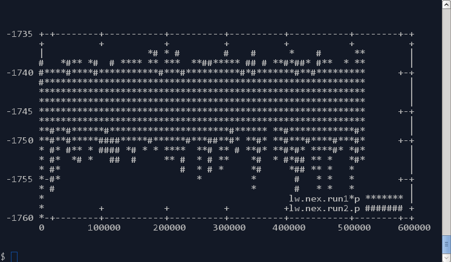
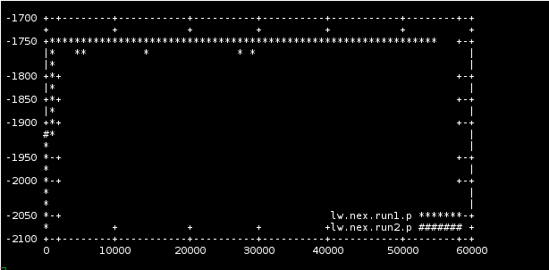
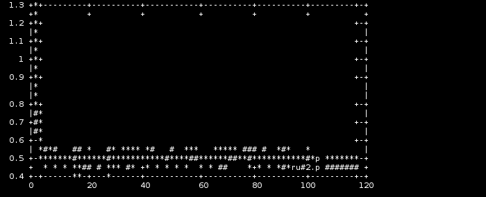
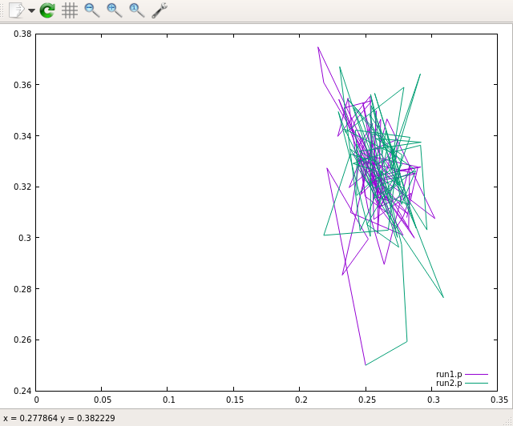
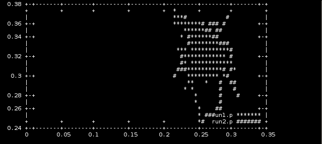
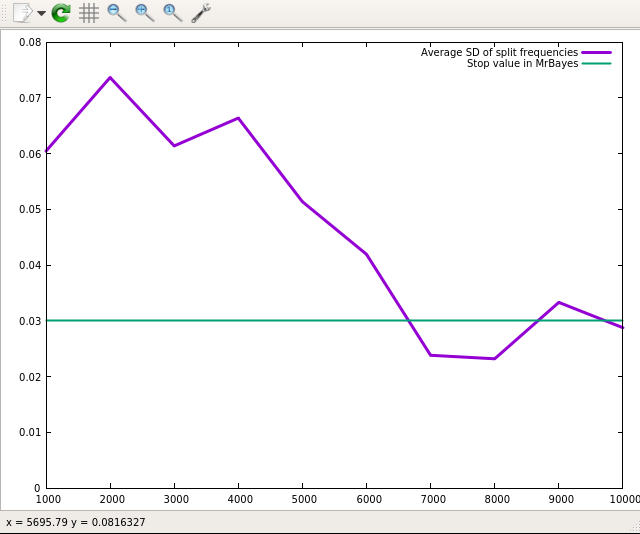
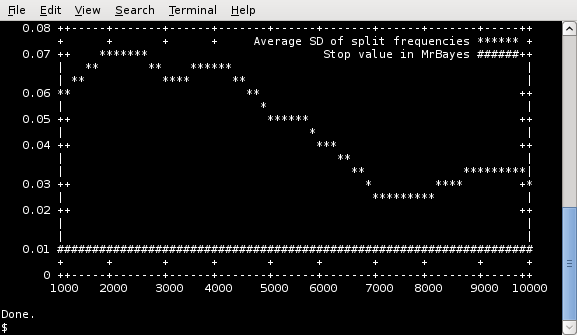

# plotMCMCoutput

Shell scripts (bash) for plotting MCMC output from, e.g.,
[MrBayes](https://github.com/NBISweden/MrBayes/), [BEAST
X](https://beast.community/), [BEAST 2](https://www.beast2.org/) etc, using
[gnuplot](http://www.gnuplot.info).

## Usage

    $ plotMCMCoutput.sh [-b burnin] [-o file | -l, -t] [[-c column] | [-x column][-y column]] file(s)

## Examples

### Plot trace of log Likelihood in MrBayes .p files

    $ plotMCMCoutput.sh data/*.p

### Plot trace of log Likelihood with burnin = 50

    $ plotMCMCoutput.sh -b 50 data/*.p

### Plot trace of log Likelihood in terminal (no graphics)

    $ plotMCMCoutput.sh -t data/*.p

### Plot trace of log Likelihood to file (PNG)

    $ plotMCMCoutput.sh -o out.png data/*.p

### Plot trace of log Likelihood from a growing ("live") file

    $ plotMCMCoutput.sh -l data/*.p

    $ plotMCMCoutput.sh -t -l data/*.p

### Find out what parameters you have in the p file

    $ grep '^Gen' data/run1.p | tr '\t' '\n' | nl
        1	Gen
        2	LnL
        3	TL
        4	pi(A)
        5	pi(C)
        6	pi(G)
        7	pi(T)

### Plot selected columns

    $ plotMCMCoutput.sh -c 3 data/*.p

    $ plotMCMCoutput.sh -t -c 3 data/*.p

    $ plotMCMCoutput.sh -x 4 -y 7 data/*.p

    $ plotMCMCoutput.sh -t -x 4 -y 7 data/*.p

### Plot average standard deviation of split frequencies, specifying 0.03 as the treshold

    $ plotstddev data/runs.1.2.mcmc 0.03

    $ plotstddev_term.sh -t data/runs.1.2.mcmc 0.03

## Files

- [`plotMCMCoutput.sh`](plotMCMCoutput.sh) -- General script for quickly plotting
  column data.
- [`plotstddev`](plotstddev) -- Plot the standard deviation of split frequencies
  in a MrBayes .mcmc file.
- [`plotstddev_term.sh`](plotstddev_term.sh) -- Plot the standard deviation of
  split frequencies in a MrBayes .mcmc file, but plot in terminal window
  instead of device.
- [data/run1.p](data/run1.p) -- Example parameter file from MrBayes v.3
- [data/run2.p](data/run2.p) -- Example parameter file from MrBayes v.3
- [data/runs.1.2.mcmc](data/runs.1.2.mcmc) -- Example .mcmc file from MrBayes v.3
- [apptainer/](apptainer/README.md) -- Files for running plotMCMCoutput.sh as
  singularity/apptainer image

## Dependencies

All scripts are dependent on the [gnuplot](http://www.gnuplot.info/) software.

## License and Copyright

Copyright (c) 2010-2025 Johan Nylander. MIT [LICENSE](LICENSE)

## Download

<https://github.com/nylander/plotMCMCoutput>
